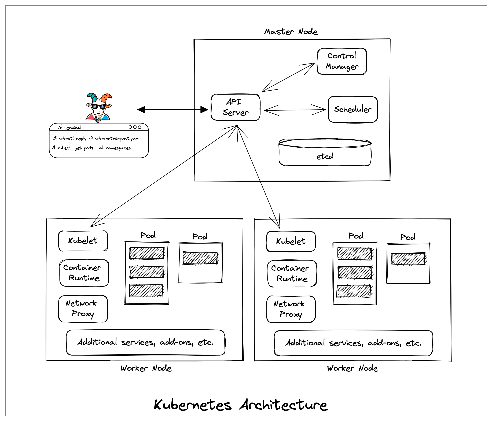

# 📖 Learning Kubernetes

[**Kubernetes**](https://kubernetes.io) is an open source container orchestration engine for automating deployment, scaling, and management of containerized applications. The open source project is hosted by the Cloud Native Computing Foundation ([CNCF](https://www.cncf.io/about)).

## What is Kubernetes

Kubernetes is a portable, extensible, open-source platform for managing containerized workloads and services, that facilitates both declarative configuration and automation. It has a large, rapidly growing ecosystem. Kubernetes services, support, and tools are widely available.

The name Kubernetes originates from Greek, meaning helmsman or pilot. Google open-sourced the Kubernetes project in 2014. Kubernetes combines over 15 years of Google's experience running production workloads at scale with best-of-breed ideas and practices from the community.

Reference: [https://kubernetes.io/docs/concepts/overview/what-is-kubernetes](https://kubernetes.io/docs/concepts/overview/what-is-kubernetes/)

## Kubernetes Overview

A Kubernetes cluster consists of a set of worker machines, called nodes, that run containerized applications. Every cluster has at least one worker node.

Below are very high-level components in Kubernetes Cluster

**Control Plane Components**

* API Server
* etcd
* Scheduler
* Controller Manager

**Node Components**

* kubelet
* Network Proxy (kube-proxy)
* Container runtime

**Add-Ons**

* DNS
* Container Resource Monitoring
* Cluster-level Logging

Reference: [https://kubernetes.io/docs/concepts/overview/components](https://kubernetes.io/docs/concepts/overview/components/)

:::tip

Use the free Katacoda playgrounds if required to learn more about the Kubernetes and it's concepts at [https://kubernetes.io/docs/tutorials/kubernetes-basics/](https://kubernetes.io/docs/tutorials/kubernetes-basics/)

:::

## The Illustrated Children’s Guide to Kubernetes

The Illustrated Children’s Guide to Kubernetes is a simple, gentle answer a father gave his daughter when she inquisitively asked about Kubernetes. It’s dedicated to all the parents who try to explain software engineering to their children. The star of The Illustrated Children’s Guide to Kubernetes, Phippy and her friends explain the core concepts of Kubernetes in simple terms.

Reference: [The Illustrated Children's Guide to Kubernetes Video](https://www.youtube.com/watch?v=4ht22ReBjno)

## Resources to learn more about Kubernetes

* [Kubernetes Docs](https://kubernetes.io/docs/home/)
* [Kubernetes Tutorials](https://kubernetes.io/docs/tutorials/)
* [Kubernetes by Examples](https://kubernetesbyexample.com/)
* [Kubernetes Components](https://kubernetes.io/docs/concepts/overview/components/)
* [CNCF Phippy and friends](https://www.cncf.io/phippy/)
