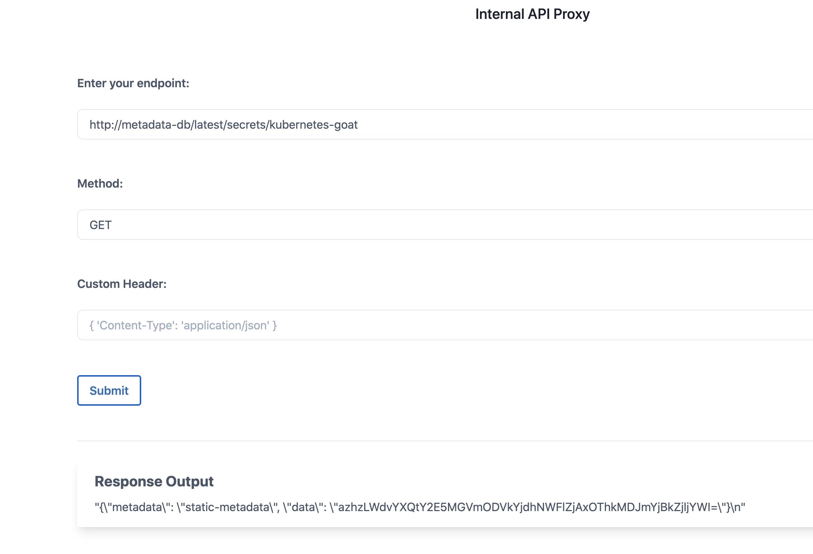

# ⎈ SSRF in the Kubernetes (K8S) world

## 🙌 Overview

This scenario is to showcase the popular application security vulnerability getting exploited everywhere in the cloud environments. Now we will try to see how it impacts the Kubernetes clusters, internal services, and microservices as well. This has quite a large impact in cloud native environments, one of the real-world examples include [Shopify - SSRF in Exchange leads to ROOT access in all instances](https://hackerone.com/reports/341876).


By the end of the scenario, we will understand and learn the following

1. How to exploit SSRF vulnerabilities in applications in cloud environments
2. Learn to understand the metadata query features to gain access to cloud provider data
3. Understand and leverage Kubernetes native service discovery features and service DNS queries
4. Gain access to internal microservices within-cluster environments

### ⚡️ The story

SSRF (Server Side Request Forgery) vulnerability became the go-to attack for cloud native environments. Here in this scenario, we will see how we can exploit an application vulnerability like SSRF to gain access to cloud instance metadata as well as internal services metadata information. Especially we see the power of native features in Kubernetes like service discovery to leverage and gain access to other internal microservices access.

:::info

To get started with the scenario, navigate to [http://127.0.0.1:1232](http://127.0.0.1:1232)

:::


### 🎯 Goal


:::tip

To complete this scenario you need to obtain the `k8s-goat-FLAG` flag value in the metadata secrets.

:::

### 🪄 Hints & Spoilers

<details>
  <summary><b>✨ Not seeing anything fancy from response? </b></summary>
  <div>
    <div>Understand the cloud provider/platform and learn to query the metadata APIs and other internal services. For example <b>http://169.254.169.254/latest/meta-data/</b> for AWS, similarly <b>servicename.namespace.svc.cluster.local</b> for internal Kubernetes services 🙌</div>
  </div>
</details>

<details>
  <summary><b>✨ Able to query metadata-db service? </b></summary>
  <div>
    <div>There is another internal service running at http://metadata-db/latest/ which serves metadata as a microservice in the cluster. It might contains some useful juicy information 🎉</div>
  </div>
</details>

## 🎉 Solution & Walkthrough

### 🎲 Method 1

:::info

`169.254.169.254` is a dynamically configured IPv4 link-local address. It's valid only on a single network segment and is not to be routed. Most cloud providers use this address to serve the compute metadata for instances, including major providers like AWS, GCP Azure, Digital Ocean, etc.

:::

:::note

We can go ahead and access the default instance metadata service using `169.254.169.254`. We also need to identify which cloud provider the service is using to run this compute so that we can use specific headers and queries. If this is not hosted in the cloud provider, then we can skip this and move to the internal service queries like other microservices and internal services within the Kubernetes cluster.

:::

* We can start with enumeration and reconnaissance to understand what services are running in the current instance and other networks based on the available information.

* We can also query the current container/pod to see if any other services running by querying the different ports and addresses. Let's query the port `5000` in the same container `http://127.0.0.1:5000` with method `GET`.


* As we can see, it's running some web service and returned the HTTP response as well. So now we have more data/information to further our attack towards more access within the Kubernetes network services.

* Now we can see that there is an internal-only exposed service within the cluster called `metadata-db`, let's a query and see if we can get any more useful information `http://metadata-db`.


* After enumerating through the entire key values, finally we can see that there is a flag at `http://metadata-db/latest/secrets/kubernetes-goat` endpoint.



* We can decode the returned/obtained base64 flag to see the information

```bash
echo -n "azhzLWdvYXQtY2E5MGVmODVkYjdhNWFlZjAxOThkMDJmYjBkZjljYWI=" | base64 -d
```


* Hooray 🥳 , now we can see that it contains Kubernetes Goat flag

## 🔖 References

* [PayloadsAllTheThing - Server-Side Request Forgery](https://github.com/swisskyrepo/PayloadsAllTheThings/tree/master/Server%20Side%20Request%20Forgery)
* [DNS for Services and Pods in Kubernetes](https://kubernetes.io/docs/concepts/services-networking/dns-pod-service/)
* [Retrieve instance metadata in AWS](https://docs.aws.amazon.com/AWSEC2/latest/UserGuide/instancedata-data-retrieval.html)
* [Metadata in Google Cloud Provider](https://cloud.google.com/compute/docs/metadata/overview)
